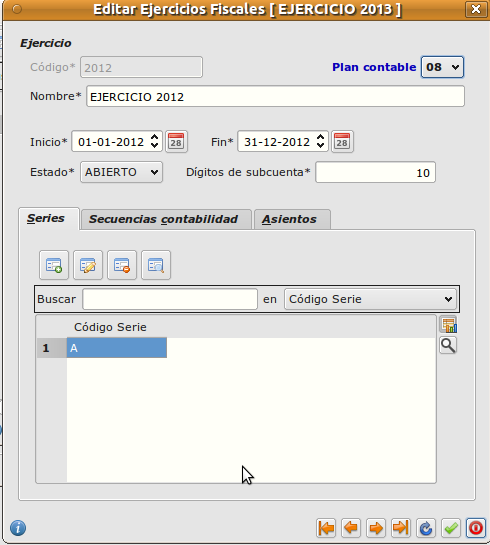

==============================
Área de facturación
==============================

Introducción
-----------------------------------

En este área se gestiona todo lo que tiene que ver con procesos de compra y de venta. Los documentos que se manejarán serán presupuestos, pedidos, albaranes y facturas. Además, en este área se encuentran muchos datos fundamentales para la empresa como los clientes, proveedores y artículos.

Facturación
-----------------------------------

Principal
-----------------------------------

Empresa
""""""""""""""

Dentro de este apartado se introduce la información referente a su empresa, para ser utilizada posteriormente en los listados o documentos.
Se diferencian tres pestañas: *General*, *Valores por defecto* y *Configuración local*.

   
En la pestaña *General* vamos introduciendo los datos de la empresa; cabe destacar el campo *Ejercicio*, es necesario relacionar la empresa con un ejercicio fiscal para que pueda llevarse la contabilidad. Si este ejercicio está creado bastará con pulsar sobre el botón y asignarlo, de lo contrario al pulsar sobre el botón tendrá que crearse el ejercicio de la siguiente forma:

   
Lo más importante a tener en cuenta en la creación del ejercicio fiscal es la fecha de inicio y la fecha de fin (duración del año contable). Después indicamos la serie de los documentos. Esta serie delimita el código numérico por el que comenzarán a contar los informes (tanto de compras como de ventas) de cada año fiscal.

Una vez insertado el ejercicio debemos introducir el logo de la empresa, el cual será utilizado para los albaranes, facturas, etc. En el botón *Abrir fichero de imagen* podemos importar el logo a la aplicación.

Pasamos a la pestaña *Valores por defecto*. En este apartado se asignan todos los valores que se quiere que aparezcan por defecto en Eneboo (*Divisa*, *Forma de pago*, *Almacén*, *Serie de Facturación*).

Clientes
""""""""""""""

Aquí vamos a introducir todos los datos relacionados con los clientes de la empresa. Esta información será la que se utilizará para todas las gestiones asociadas con ellos: entrada de albaranes, facturas, tesorería, etc.

A continuación como ejemplo se verá el diseño de una ficha de un cliente. Seleccionamos el menú *Área de Facturación → Principal → Clientes* (doble clic).

.. figure:: images/master_clientes.png
   :width: 800 px

La parte superior muestra los botones disponibles que se detallan a continuación:

- *Insertar registro*: Se utiliza para dar de alta fichas. Desde el teclado pulsando tecla A.
- *Modificar registro*: Se utiliza para modificar datos de una ficha. Desde el teclado pulsando tecla M.
- *Eliminar registro*: Se utiliza para eliminar la ficha ya existente. Desde el teclado pulsando tecla E.
- *Ver registro*: Se utiliza para abrir la ficha del cliente y ver los datos. Desde el teclado pulsar tecla I.
- *Copiar registro*: Se utiliza para crear un duplicado del cliente seleccionado. Desde el teclado pulsar tecla C.

A continuación se detalla paso a paso cómo se realiza la entrada de una ficha de un cliente.

.. figure:: images/editar_clientes.png
   :width: 800 px

Las casillas con asterisco (*) se deben de rellenar obligatoriamente.

El código de cliente se puede cambiar o de lo contrario utilizará el código que Eneboo asigna por 
defecto.

**General**

Dentro de la pestaña *General* rellenamos los datos más generales del cliente como por ejemplo el tipo de identificación (NIF, pasaporte, Certificado de residencia...) y el número. Teléfonos, fax,  e-mail, web...
En *Grupo de clientes* ponemos, en su caso, si el cliente pertenece a un grupo, por ejemplo: Cliente Habitual y si le aplicamos una tarifa especial.
Pulsando el botón *Insertar* se nos abre una ventana para incluir la dirección del cliente.
En *Observaciones* podemos indicar cualquier dato a tener en cuenta.
Si marcamos la casilla *De baja*, tenemos que indicar la fecha y este cliente no lo podemos utilizar para generar cualquier documento como albaranes, facturas, etc.

**Comercial**

Será donde se indiquen sus condiciones comerciales, formas de pago, moneda, serie de facturación, 
IVA, etc... Con estos datos y los días de pago, Eneboo calcula la fecha de los vencimientos. También podemos insertar el agente que lleva su ficha.

Si hay algún tipo de descuento que se le realice al cliente específicamente y que se aplique a todas las ventas que se le realicen también es en esta pestaña donde se configura.

**Direcciones**

En este apartado se pueden indicar si el cliente dispone de varias direcciones, como por ejemplo, dirección de facturación, dirección fiscal...

**Cuentas Bancarias**

En caso de que el cliente pueda tener varias domiciliaciones bancarias para la tramitación de los recibos, serán indicadas en esta sección.

**Agenda**

En este apartado se indican las personas de contacto. En la parte superior derecha aparecen dos “clips”. El de color azul es para asociar a un contacto y el rojo para eliminar asociación.

**Descuentos**

Será donde se indique si a este cliente se le aplica algún descuento a parte.

**Documentos**

En este apartado podemos visualizar todos los documentos generados a este cliente, como pueden ser *Presupuestos*, *Pedidos*, *Albaranes*, *Facturas* o *Recibos*.

**Contabilidad**

Se informará en esta sección de los datos fiscales y las cuentas contables para su posterior trabajo en contabilidad.

Para finalizar y guardar todos los datos en la parte inferior derecha hacemos clic en el símbolo verde.

Proveedores
"""""""""""""""""""

Los datos de los proveedores más adelante se utilizan para todas las gestiones asociadas con ellos, como entrada de albaranes, facturas, contabilidad, etc.

Para abrir la lista de proveedores seleccionamos el menú *Área de Facturación → Principal → Proveedores* (doble clic).

La gestión de proveedores (insertar, modificar, eliminar, etc.) se hace de igual forma que se ha explicado para la gestión de Clientes_.

A continuación se muestra una ficha de proveedor.

.. figure:: images/editar_proveedores.png
   :width: 800 px

Ejercicios fiscales
"""""""""""""""""""""

Como hemos indicado anteriormente, es necesario relacionar la empresa con un ejercicio fiscal para que pueda llevarse la contabilidad.

Lo más importante a tener en cuenta en la creación del ejercicio fiscal es la fecha de inicio y la fecha de fin (duración del año contable). Después indicamos la serie de los documentos. Esta serie delimita el código numérico por el que comenzarán a contar los informes (tanto de compras como de ventas) de cada año fiscal.

Series de facturación
""""""""""""""""""""""""

Una empresa puede tener varias series de facturación, como por ejemplo en el caso de facturas rectificativas o cuando esta empresa cuente con varios establecimientos desde los que efectúe sus operaciones.

La numeración de los documentos (presupuestos, pedidos, albaranes y facturas) dentro de cada serie será correlativa.

Impuestos
"""""""""""""

Se detallan e introducen los diferentes tipos de impuestos a los que está sujeta nuestra empresa. Así tendremos, por ejemplo, los distintos tipos de IVA para poder aplicarlos de forma automática cada vez que se requieran.

.. figure:: images/editar_series_facturacion.png
   :width: 800 px
   
Cuentas Bancarias
""""""""""""""""""""""""

En este apartado se introducen las diferentes cuentas bancarias pertenecientes a nuestra empresa y de las cuales nos servimos para los cobros y pagos. Serán necesarias para poder llevar a cabo las remesas y otro tipo de acciones dependientes de nuestros números de cuenta.

Bancos
""""""""""""""

En la aplicación ya están preintroducidos (por defecto) los principales bancos. Tan sólo habrá que introducir los bancos que no se muestren en dicho listado en caso de requerirlos.

.. figure:: images/editar_bancos.png
   :width: 800 px
   
Descuentos
"""""""""""""""""

Se podrán crear todo tipo de descuentos que queramos aplicar a cada cliente. Los iremos introduciendo a través de este sencillo formulario.

   
Formas de pago
""""""""""""""""""

Dependiendo de las diferentes formas de pago que acepte nuestra empresa, en este apartado serán creadas dichas formas de pago.

   
Tipos de rappel
"""""""""""""""""""""""

Los tipos de rappel permiten definir conjuntos de intervalos de cantidades con un descuento asociado a cada cantidad, para ser utilizadas en la facturación. Los iremos introduciendo de la misma forma que los descuentos.

Agentes
""""""""""""""""

Este apartado sirve para dar de alta a los agentes encargados de las relaciones comerciales. Los agentes podrán asignarse a cuentas de clientes y podrá indicarse el tipo de comisión que obtendrán (en caso de estar sujetos a comisión) por sus ventas.

Usuarios
"""""""""""""""

Los usuarios son las distintas personas que trabajan con la aplicación. A estos usuarios se les podrá dar distintos permisos con el módulo control de acceso. Se pueden dar de alta tantos usurarios como queramos.

En el campo *Identificador* indicaremos el nombre con el que accederá dicho usuario a la aplicación. Después se introduce el departamento al que pertenece, si no aparece en el listado tendremos que crear el nuevo departamento.

Departamentos
"""""""""""""""""

Si la empresa dispone de distintos departamentos y se quiere llevar un control de ellos, se pueden dar de alta tantos departamentos sean necesarios. La forma de introducirlos es muy sencilla.

El código se asigna por defecto o también le podemos asignar otro distinto. Después introducimos el nombre del departamento.

Grupos de clientes
""""""""""""""""""""""

Un grupo de clientes sirve para asignar una tarifa específica sobre los precios de venta. Por ejemplo, de compra frecuente, de compra ocasional, de altos volúmenes de compra, etc.

Para asignar un cliente a un grupo de clientes lo haremos desde su ficha.

Los precios especiales dependerán de la tarifa que asignemos. Para crear tarifas Ver apartado *Almacén –> Tarifas*.

Divisas
""""""""""""

Eneboo permite trabajar con distintos tipos de divisa. La aplicación tiene por defecto un listado con diversos tipos de divisas. También se pueden dar de alta en el caso de que no se encuentren en dicho listado.

Países y Provincias
"""""""""""""""""""""""""""

En el caso del apartado de países la aplicación contiene por defecto España, pero podemos crear tantos como queramos. En el caso de las provincias viene un listado precargado de provincias españolas, pero al igual que en el apartado de países se pueden crear tantas como queramos.

Almacén
-----------------------------------

Eneboo permite gestionar de forma automática el control de sotck de sus artículos en tiempo real, con la posibilidad añadida de trabajar con varios almacenes.
Para llevar esta gestión se realiza la entrada y la salida de artículos, mediante unos documentos que aumentan o disminuyen el stock. 

Para poder sacar el máximo partido a Eneboo hay que conocer perfectamente cómo reacciona cada documento sobre el stock.

A continuación se detalla el efecto que producen las líneas de cada documento sobre el stock.

==========          ======================= ==========          =======================
Documento           Efecto sobre el stock   Documento           Efecto sobre el stock
==========          ======================= ==========          =======================
Ofertas de venta    No afecta stock         Ofertas de compra   No afecta a stock
Pedidos de venta    No afecta stock         Pedidos de compra   No afecta a stock
Albaranes de venta  Disminuye stock         Albaranes de compra Aumenta stock
Facturas de venta   Disminuye stock         Facturas de compra  Aumenta stock
==========          ======================= ==========          =======================

El stock de un almacén no puede modificarse en la ficha del artículo, sino que debe producirse un movimiento en cualquiera de los documentos especificados. Por ejemplo, en el caso de que sea necesario, porque el stock no cuadra con el stock real, se realiza una regularización.

Datos Generales
""""""""""""""""""""

Antes de nada debemos definir el IVA que se aplica por defecto para los artículos en los distintos procesos (ventas o compras).

Artículos
"""""""""""""

Para acceder a la gestión de artículos haremos doble clic en la opción de menú *Área de facturación -> Almacén -> Artículos*. En este apartado aparece la relación de artículos que hemos dado de alta. Al igual que en cualquier lista de datos podemos crear un artículo nuevo, modificar, borrar, ver, duplicar, etc., como se ha explicado para los Clientes_.

La ficha de artículo es como se muestra a continuación.

.. figure:: images/editar_articulos.png
   :width: 800 px

En el cuadro de *Referencia* indicamos la referencia o código del artículo y a continuación la descripción.

Tenemos varias pestañas: *General*, *Venta*, *Compra*, *Stocks*, *Agentes*, y *Contabilidad*.

**General**

Aquí indicamos la *Familia* a la que pertenece, en el caso de que pertenezca a alguna. La clasificación de los artículos en familias puede resultar muy útil para generar listados de artículos de cualquier tipo.

Si el artículo no necesita cotrol de stock, como por ejemplo las horas de trabajo, marcamos la casilla de *Sin stock*. De esta manera cada vez que hagamos un albarán, no descontará stock de este artículo.

También podemos indicar si este artículo *Se compra* o *Se vende*. Al marcar cada una de las opciones se habilita o deshabilita la pestaña correspondiente.

Podemos añadir una imagen a partir de un archivo.

El campo *Código de barras* se utiliza si se usa un lector de códigos de barras.

Y en el apartado *Observaciones* podemos indicar cualquier anotación sobre este artículo.

**Venta**

En esta pestaña indicaremos el precio de venta del artículo. En caso de necesitar varios precios de venta, por ejemplo tarifas de distribuidor, de grandes almacenes, clientes finales, etc. utilizaremos las tarifas. Si tenemos tarifas creadas, al pinchar en *Generar precios* nos aparecerán los distintos precios.

También especificaremos el tipo de IVA de este artículo.

**Compra**

En esta pestaña vamos a indicar los proveedores que suministran este artículo y el precio de coste de 
cada uno de ellos.

**Stocks**

Aquí indicaremos el stock mínimo y máximo. También podemos marcar *Permitir ventas sin stock* para que, en el caso de que no tengamos stock, podamos hacer un albarán o factura.

A veces, sucede que la cantidad almacenada puede variar por razones diferentes a las compras o ventas. Hay unidades de mercancía que se rompen, se pierden, se estropean, etc. Entonces, hay una posibilidad de que el stock registrado en las bases de datos no coincida con el stock real depositado en los almacenes. Por tanto, es conveniente que periódicamente el usuario ajuste el stock que tenemos grabado en Eneboo. Esto lo podemos hacer desde la misma ficha del artículo o bien en el apartado *Regularización de stocks*.

**Agentes**

En caso de trabajar con agentes comerciales, se introducen y podemos indicar la comisión a la que estará sujeta la venta de este artículo.

**Contabilidad**

En este apartado podemos especificar la *Subcuenta de compras*, la *Subcuenta de ventas* y el *IRPF de Compras*.

Tesorería
-----------------------------------

Informes
-----------------------------------
